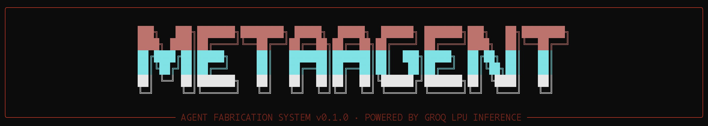
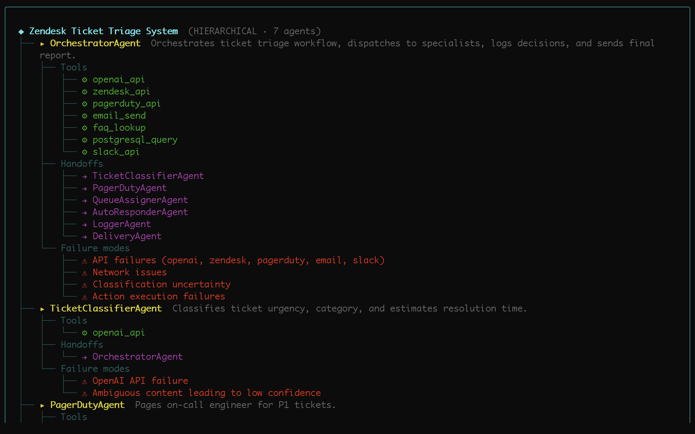
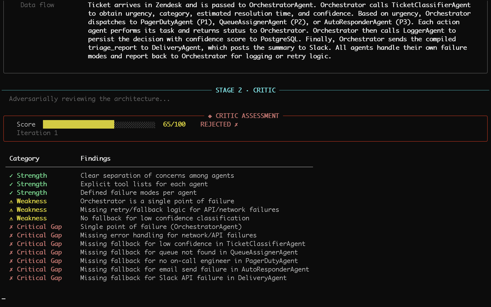
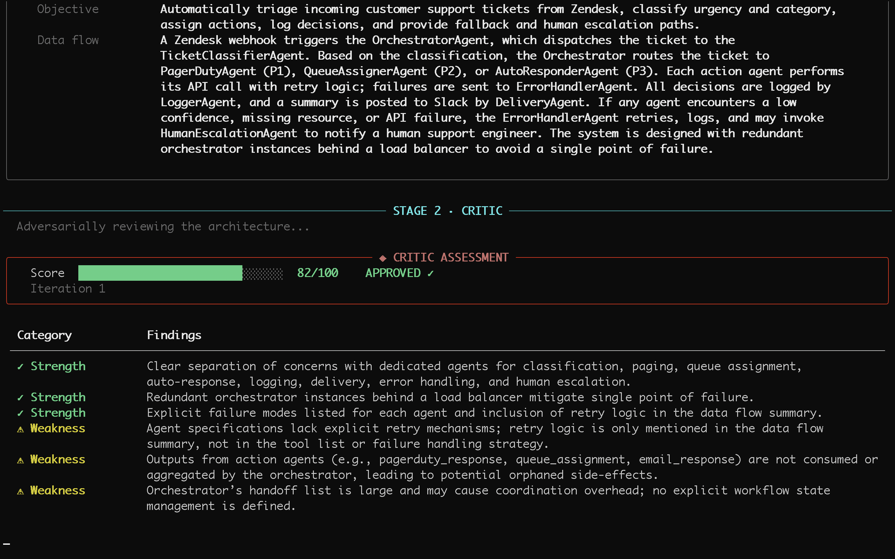
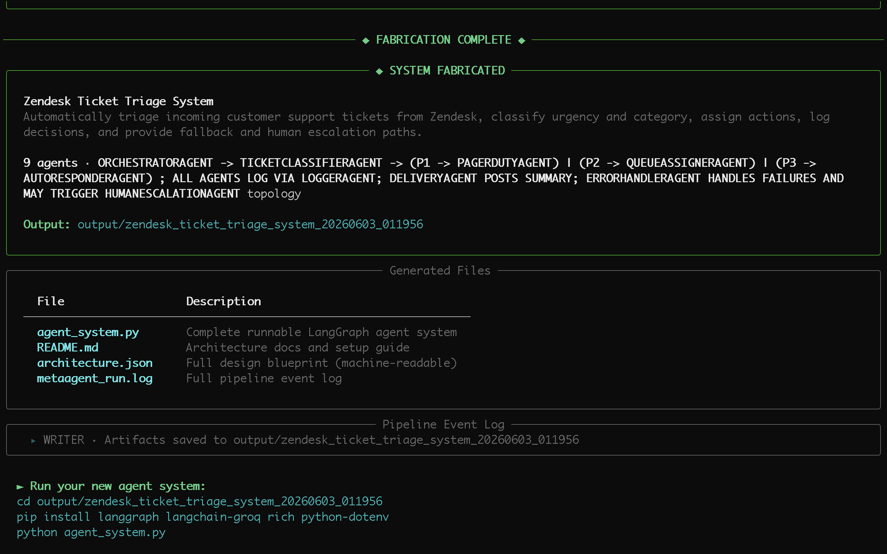

> *The autonomous, self-correcting meta-framework that builds production-ready agentic systems.*

[](https://www.python.org/)
[](https://langchain-ai.github.io/langgraph/)
[](https://groq.com/)
[](https://typer.tiangolo.com/)
[](https://rich.readthedocs.io/)
[](https://pydantic-docs.helpmanual.io/)
[](LICENSE)

MetaAgent bridges the gap between high-level human ideas and complex multi-agent architectures. By feeding it a plain English job description, MetaAgent utilizes an internal **Architect-Critic-Synthesizer** loop to spin up enterprise-grade, deterministic, and fully documented LangGraph code in seconds.

---

## ✨ Core Features

* **🚀 Zero-to-Agent Pipeline**: Transform raw text prompts into orchestrated multi-agent systems instantly.
* **🧠 Self-Correcting Architecture**: Built-in adversarial agent loop critiques, refines, and validates design blueprints before writing a single line of code.
* **⚡ Real-Time Streaming TUI**: Watch complex multi-stage graphs compute live through an elegant, animated terminal interface powered by `Rich`.
* **🛡️ Production-Ready Guardrails**: Every generated python file natively includes strict Pydantic validation, explicit state handling, and structured logging.
* **🔧 Structural Flexibility**: Switch between complete system generation or decoupled `--design-only` mode for quick architectural brainstorming.
* **📚 Auto-Generated Blueprints**: Produces clean Markdown READMEs and standardized JSON schemas for every generated system.

---

## 📸 System Visualizations

### 1. Architectural Topology Design
When initialized with a natural language specification, MetaAgent immediately constructs a comprehensive multi-agent hierarchical tree. This explicitly maps out operational tools, structural handoff paths, and edge-case failure boundaries for every agent.


*Figure 1: Generated multi-agent hierarchical tree mapping architectural blueprints directly from human text.*

### 2. Stage 2: Adversarial Critic Review (Initial Assessment)
Once designed, the blueprint is passed to an automated Critic agent. The Critic aggressively stress-tests the layout against production software architectures, calling out single points of failure or unhandled API limits.


*Figure 2: Critic engine identifying critical architectural gaps and issuing a "REJECTED" status on Iteration 1.*

### 3. Iterative Pipeline Auto-Correction
The design loop automatically attempts to self-correct based on the Critic's specific feedback. It restructures nodes, integrates dedicated error-handling sub-graphs, and embeds redundancy layers until the system scores an approved status.


*Figure 3: Refined multi-agent topology earning an "APPROVED" architecture score after programmatic auto-correction.*

### 4. Compilation & Package Delivery
After earning Critic validation, the system moves to synthesis. It converts the validated blueprint into functional code modules, tests, and configuration assets inside an isolated deployment folder.


*Figure 4: Fabricator completion screen displaying the generated code manifest and quick-start launch actions.*

---

## 🚀 Quick Start

### Prerequisites
* **Python**: Version `3.10` or higher
* **Inference API**: A free [Groq API Key](https://groq.com)

### Installation
```bash
# 1. Clone the repository
git clone https://github.com
cd metaagent

# 2. Install package in editable development mode
pip install -e .

# 3. Initialize your environment variables
cp .env.example .env
```
Open your `.env` file and append your API credential:
```env
GROQ_API_KEY=gsk_your_actual_key_here
```

### Usage Examples
```bash
# Generate a complete production agent system from a prompt
metaagent build "Monitor competitor pricing daily and alert on Slack on sudden drops"

# Pass a long-form business requirements document (BRD) via file input
metaagent build --file ./jobs/customer_support_triage.txt --output ./generated_agents

# Prototype structural topologies quickly without synthesizing raw code
metaagent build "A research agent that cross-references arXiv with PubMed" --design-only

# Check configuration, default models, and systemic environment status
metaagent info
```

---

## 🏗️ Technical Architecture: How it Works

MetaAgent runs a strict **6-stage pipeline** orchestrated via an immutable LangGraph state machine.

```text
 [ Human Input ] 
       │
       ▼
 1. ARCHITECT   ──► Designs optimal multi-agent topology & state requirements.
       │
       ▼
 2. CRITIC      ──► Adversarially stress-tests layout against software patterns.
       │
 ┌─────┴────────┐
 ▼              ▼
[Passed]     [Failed] ──► 3. REVISION LOOP (Max 2 iterations to auto-correct)
 │
 ▼
 4. SYNTHESIZER ──► Translates structural blueprint into executable Python + LangGraph code.
       │
       ▼
 5. VALIDATOR   ──► Conducts static syntax checks, linting, and state-graph safety checks.
       │
       ▼
 6. WRITER      ──► Packages production code, JSON schemas, logs, and user-facing docs.
```

### 📁 Generated Output Structure
Every compiled agent system generates an isolated, immutable deployment directory:
```bash
output/<system_name>_<timestamp>/
├── 🤖 agent_system.py      # Executable production-ready LangGraph system
├── 📖 README.md            # Detailed end-user setup and architectural map
├── 📐 architecture.json     # Standardized JSON blueprint (ideal for CI/CD tracking)
└── 📋 metaagent_run.log     # Raw pipeline logs mapping the original synthesis process
```

---

## ⚙️ Configuration Variables

Tweak performance by managing keys directly within your `.env` matrix:


| Variable               | Type   | Default                   | Description                                                        |
| :--------------------- | :----- | :------------------------ | :----------------------------------------------------------------- |
| `GROQ_API_KEY`         | String | *Required*                | API key for lightning-fast inference on Groq's LPU infrastructure. |
| `METAAGENT_MODEL`      | String | `llama-3.3-70b-versatile` | Base LLM engine utilized to drive structural design and synthesis. |
| `METAAGENT_OUTPUT_DIR` | String | `./output`                | The target root path where generated systems are written.          |

---

## 💡 Contribution Ideas & Engineering Roadmap

For open-source contributions, below are high-impact feature areas where you can make a significant impact immediately. Feel free to claim or discuss these inside our [Issues tab](https://github.com).

### 🟢 Easy Wins (Good First Issues)
* **Custom Prompt Templates**: Abstract internal System Prompts into editable `.yaml` configuration files so users can tweak the Critic or Architect behavioral personas.
* **Export to Mermaid.js**: Add a flag inside the `Writer` module to automatically output a visual `.mermaid` flow diagram within the generated project's `README.md`.
* **Extended Model Ecosystem**: Expand the environment loader to support alternative provider engines (e.g., Anthropic, OpenAI, or local Ollama instances).

### 🟡 Intermediate Implementations
* **Integrated Unit-Test Synthesizer**: Expand the code generation loop to create a complementary `test_agent_system.py` file utilizing `pytest` to simulate mock events through the graph.
* **Dockerization Workflow**: Update the output pipeline to emit a generic `Dockerfile` and `requirements.txt` unique to each generated system for containerized microservice deployments.
* **Multi-File Code Gen**: Modify the `Synthesizer` to cleanly separate complex tools, schemas, and state declarations into distinct sub-modules (`tools.py`, `state.py`) rather than a single monolith.

### 🔴 Advanced Infrastructure (Long-Term Roadmap)
* **Dynamic Code Validation Sandbox**: Safely execute the compiled system within an isolated, localized Python subprocess during the `Validator` phase to confirm runtime graph integrity.
* **Human-in-the-Loop Interventions**: Pause the LangGraph fabrication pipeline mid-stream to let developers edit the raw JSON blueprint directly inside the terminal UI before code compilation begins.

---

## 📄 License

This framework is completely open-source and licensed under the [MIT License](LICENSE).

---

### 🚀 Fabricate Your First Autonomous System Today
```bash
metaagent build "Build a multi-agent moderator that vets customer feedback, flags toxicity, and translates text"
```
****